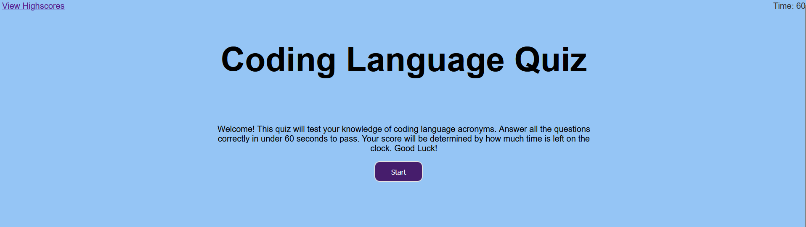

# code-quizzer

## Description

A timed multiple-choice quiz on coding languages. The current questions are simple, but can be substituted for more difficult questions in order to test the user. The purpose of building this application was to practice using JavaScript, including localStorage, objects, and functions. By building this quiz I learned about adding and retrieving objects from localStorage and dynamically updating a the HTML of a page by creating, appending, and removing elements.

## Usage

https://jubernst.github.io/code-quizzer/
Press 'Start' to begin the quiz or 'View Highscores' to view the most recent score.

## Credits

Answers retrieved from wikipedia.org

## License

MIT License
